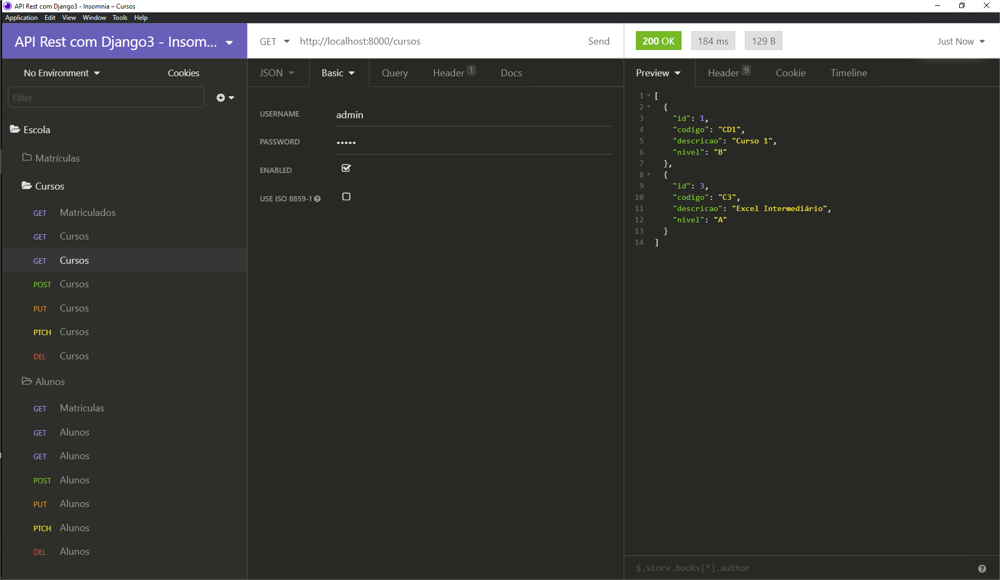
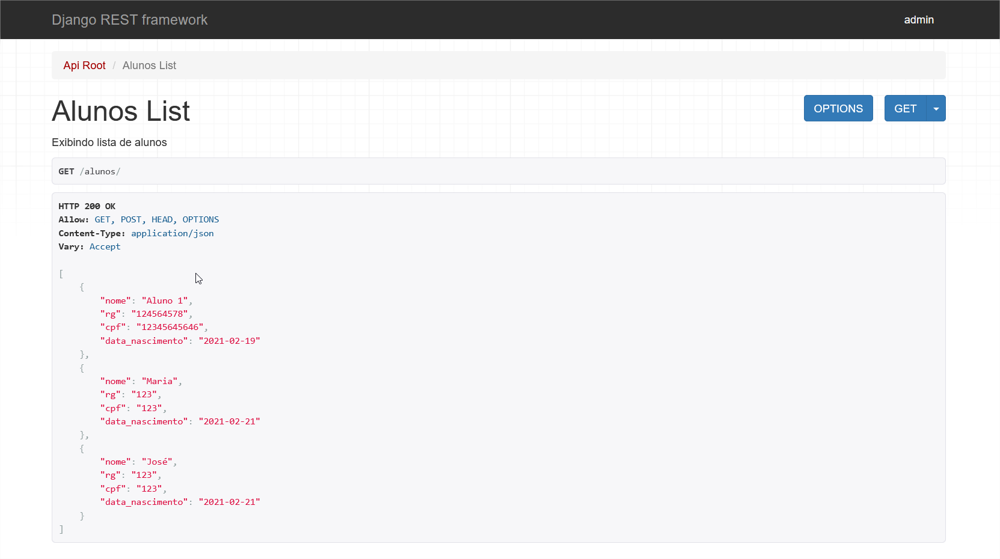

# API REST com Django3

## Detalhes

Projeto baseado em curso da Alura

[API com Django 3: Django Rest Framework](https://cursos.alura.com.br/course/api-django-3-rest-framework)

* Descrição
    * Desenvolva uma API do zero, utilizando a linguagem Python
    * Saiba como trabalhar com modelos, serializers e views
    * Crie uma boa arquitetura em seus projetos Django Rest API
    * Integre o Django Admin à sua API
    * Descubra como criar suas próprias APIs com Django





## Anotações Pessoais do Curso

### Ambiente de Desenvolvimento

**Preparando o Ambiente**

```bash
$ python -m venv ./venv
```

**Ativando o ambiente no Windows**

[documentação venv](https://docs.python.org/pt-br/3/library/venv.html)

```bash
$ venv\Scripts\activate
```

**Instalando o Django no ambiente ativado**
```bash
$ pip install django
```

**Criando projeto utilizando Django Admin**
```bash
$ django-admin startproject setup .
```
**No arquivo "settings.py" alterar:**
* LANGUAGE_CODE = 'pt-br'
* TIME_ZONE = 'America/Sao_Paulo'

**Rodando o serviço**
```bash
$ python manage.py runserver
```

### Requisição GET

**Criando um app**
```bash
$ python manage.py startapp escola
```

**Instalando Django Rest Framework**

[https://www.django-rest-framework.org/](https://www.django-rest-framework.org/)

```bash
$ pip install djangorestframework
$ pip install markdown       # Markdown support for the browsable API.
```

* No arquivo "settings.py" adicionar o app

```python
INSTALLED_APPS = [
    ...
    'rest_framework',
]
```

### Migrations

**Criando as Migrations**
```bash
$ python manage.py makemigrations
```

**Executando as Migrations**
```bash
$ python manage.py migrate
```

### Models

**Model de Aluno**
```python
from django.db import models

class Aluno(models.Model):
    nome = models.CharField(max_length=30)
    rg   = models.CharField(max_length=9)
    cpf  = models.CharField(max_length=11)
    data_nascimento = models.DateField()

    def __str__(self):
        return self.nome
```


### Admin

**Criando o SuperUser**

```bash
$ python manage.py createsuperuser
```

**Associando Model com Admin de Aluno**
```python
from django.contrib import admin
from escola.models  import Aluno, Curso

class Alunos(admin.ModelAdmin):
    list_display       = ('id', 'nome', 'rg', 'cpf', 'data_nascimento')
    list_display_links = ('id', 'nome')
    search_fields      = ('nome',)
    list_per_page      = 20

admin.site.register(Aluno, Alunos)
```


### Serializer

**Criando o serializer de aluno**
```python
from rest_framework import serializers
from escola.models  import Aluno, Curso

class AlunoSerializer(serializers.ModelSerializer):
    class Meta:
        model = Aluno
        fields = ['nome', 'rg', 'cpf', 'data_nascimento']

class CursoSerializer(serializers.ModelSerializer):
    class Meta:
        model = Curso
        fields = '__all__'
```

### Views - Classes para HTTP

**Classes de comunicação entre o serializer e as requisições [views.py]**
```python
from rest_framework import viewsets
from escola.models  import Aluno, Curso
from serializer     import AlunoSerializer, CursoSerializer

class AlunosViewSet(viewsets.ModelViewSet):
    """Exibindo lista de alunos"""
    queryset = Aluno.objects.all()
    serializer_class = AlunoSerializer

class CursoViewSet(viewsets.ModelViewSet):
    """Exibindo lista de cursos"""
    queryset = Curso.objects.all()
    serializer_class = CursoSerializer
```

### Rotas - URLS

**Configurando as rotas da API [urls.py]**
```python
from django.contrib import admin
from django.urls    import path, include
from escola.views   import AlunosViewSet, CursosViewSet
from rest_framework import routers

router = routers.DefaultRouter()
router.register('alunos', AlunosViewSet, basename='Alunos')
router.register('cursos', CursosViewSet, basename='Cursos')

urlpatterns = [
    path('admin/', admin.site.urls),
    path('', include(router.urls)),
]
```


### Listando Matriculas de Um Aluno

**Serializer.py**
```python
class ListaMatriculasAlunoSerializer(serializers.ModelSerializer):
    curso   = serializers.ReadOnlyField(source='curso.descricao')
    periodo = serializers.SerializerMethodField()
    class Meta:
        model  = Matricula
        fields = ['id', 'curso', 'periodo']
    def get_periodo(self, obj):
        return obj.get_periodo_display()
```

**Views.py**
```python
from escola.serializer import ..., ListaMatriculasAlunoSerializer

...
class ListaMatriculasAluno(generics.ListAPIView):
    """Listando as matrículas de um aluno"""
    def get_queryset(self):
        queryset = Matricula.objects.filter(aluno_id = self.kwargs['pk'])
        return queryset
    serializer_class = ListaMatriculasAlunoSerializer
```

**Urls.py**
```python
from escola.views import ..., ListaMatriculasAluno

urlpatterns = [
    ...
    path('aluno/<int:pk>/matriculas/', ListaMatriculasAluno.as_view()),
]

```


## Autenticando as requisições

**Adicionando Basic Authentication**
```python
...
from rest_framework.authentication import BasicAuthentication
from rest_framework.permissions    import IsAuthenticated

class AlunosViewSet(viewsets.ModelViewSet):
    ...
    authentication_classes = [BasicAuthentication]
    permission_classes     = [IsAuthenticated]
```